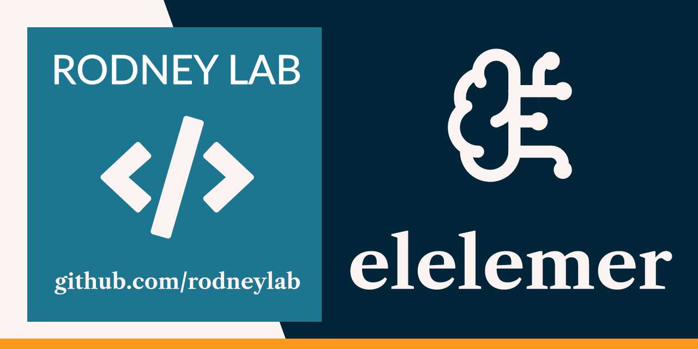

<p align="center">
  <a
    aria-label="Open Rodney Lab site"
    href="https://rodneylab.com"
    rel="nofollow noopener noreferrer"
  >
    
  </a>
</p>
<h1 align="center">elelemer</h1>

\*Lightweight CLI for running local Large Language Model (LLM) completions with
**Llama.cpp** and **Ollama**\*

## 🌟 Overview

`elelemer` makes it _trivial_ to run local LLM inference from a single CLI
command.

Running LLMs locally brings **data sovereignty** advantages and the ability to
**work off-grid**, without an Internet connection. Llama.cpp and Ollama let you
run LLM models like Gemma4, Qwen3, gpt-oss and GLM, though both are relatively
new and have their pros and cons, making either a good choice for various use
cases.

Key features:

- **Zero‑config** – small `configuration.toml` only needed if you're running
  Ollama or Llama on a different host or not using default ports.
- **Fast, zero‑cost** – everything runs locally; no API keys, no latency.
- **Privacy‑first** – your prompts never leave your machine.

elelemer offers a unified interface for both Llama.cpp and Ollama, modelled on
Ollama's CLI command structure.

Llama.cpp's **quantisation** lets you run leading models without a cutting edge GPU;
it is surprising how far you can get with a regular developer machine with a
little RAM.

## 🚀 Quick Start

```console
# With Ollama
elelemer ollama run gpt-oss:20b "What is 1 + 1?"

# With Llama.cpp
elelemer llamacpp run qwen-3.5-35b-a3b "How high is the sky?"
```

The first argument after `run` is a **model alias**. If you need to pull a
model:

| Tool      | Pull command                                               |
| --------- | ---------------------------------------------------------- |
| Ollama    | `ollama pull gpt-oss:20b`                                  |
| Llama.cpp | `llama-server -hf unsloth/Qwen3.6-35B-A3B-GGUF:UD-Q4_K_XL` |

_Tip:_ Use `ollama list` to see the aliases currently available.

If you don't yet have any models, use these lists as a starting point:

- [Ollama Library](https://ollama.com/library?sort=newest)
- [Unsloth Model
  Catalogue](https://unsloth.ai/docs/get-started/unsloth-model-catalog)

## 📦 Installation

<!-- ### 1. Pre‑built binaries -->
<!---->
<!-- | Os / Architecture | Download Url                                               | -->
<!-- | ----------------- | ---------------------------------------------------------- | -->
<!-- | Linux x86_64      | https://repo.rodneylab.com/elelemer/linux_amd64/elelemer   | -->
<!-- | macOS arm64       | https://repo.rodneylab.com/elelemer/darwin_arm64/elelemer  | -->
<!-- | Windows           | https://repo.rodneylab.com/elelemer/win_amd64/elelemer.exe | -->
<!---->
<!-- Download, unpack and put the binary in your `PATH`: -->
<!---->
<!-- ```bash -->
<!-- curl -L https://repo.rodneylab.com/elelemer/linux_amd64/elelemer -o /usr/local/bin/elelemer -->
<!-- ``` -->
<!---->
<!-- > **All binaries are compiled with Rust 1.75+ and are platform‑native.** -->

### 1. Build from source

```bash
git clone https://github.com/rodneylab/elelemer.git
cd elelemer

# Install the Rust toolchain, if you don't already have it (see
# https://www.rust-lang.org/tools/install)
curl --proto '=https' --tlsv1.2 -sSf https://sh.rustup.rs | sh

# Requires Rust toolchain installed
cargo install --path .

# Run
elelemer --version
```

## ⚙ Prerequisites

You need **one** of the following local LLM back‑ends installed and
running:

| Runner        | Install on any platform                                                      |
| ------------- | ---------------------------------------------------------------------------- |
| **Ollama**    | <https://ollama.com/download>                                                |
| **Llama.cpp** | <https://github.com/ggml-org/llama.cpp/tree/master/tools/server#quick-start> |

macOS & Linux quick install:

```bash
# macOS (Homebrew)
brew install ollama llama.cpp

# Linux (debian/ubuntu)
sudo apt install ollama llama-cpp

# Linux (fedora/redhat)
sudo dnf install ollama llama-cpp

# Windows – follow the installer on the official GitHub releases or build from source
```

## 🔧 Configuration

By default, _elelemer_ looks for `<CONFIG_PATH>/elelemer/configuration.toml`.
`CONFIG_PATH` depends on your system, here is a rough guide:

| Platform | Value                                 | Example                            |
| -------- | ------------------------------------- | ---------------------------------- |
| Linux    | `$XDG_CONFIG_HOME` or `$HOME/.config` | `home/alice/.config`               |
| macOS    | `$HOME/Library/Application Support`   | `/Users/Alice/Application Support` |
| Windows  | `{FOLDERID_LocalAppData}`             | `C:\Users\Alice\AppData\Local`     |

Default `configuration.toml` values:

```toml
system_prompt = "You are a helpful assistant"

[llamacpp]
base_url = "http://localhost:8080"
api_key = "llama.cpp"
timeout_secs = 1800

[ollama]
base_url = "http://localhost:11434"
api_key = "ollama"
timeout_secs = 1800
```

Ollama and Llama.cpp API keys can be set to anything (assuming you haven't
changed defaults on the Llama.cpp or Ollama server).

> **If you want to store credentials or secrets locally, keep the TOML file on
> the host OS, never in your Git repo.**

## 📚 Usage Guide

```console
elelemer <runner> run <model> "<prompt>"
```

- `<runner>` `ollama` or `llamacpp`
- `<model>` Name of the local model (exact alias used by the back‑end)
- `<prompt>` The user‑defined text passed to the model.

### Full command format

```bash
elelemer <runner> [options] run <model> "<prompt>"
```

> **Options** (displayed with `elelemer --help`, also in [CLI
> Documentation](./docs/help.md))

| Option              | Description                                      |
| ------------------- | ------------------------------------------------ |
| `-v`, `-vv`, `-vvv` | Override the global `logging.verbosity` setting. |
| `--config <FILE>`   | Point to an alternative configuration file.      |

## 🔧 Troubleshooting

| Symptom               | Likely cause                            | Fix                                                                                        |
| --------------------- | --------------------------------------- | ------------------------------------------------------------------------------------------ |
| “Command not found”   | `elelemer` not on `PATH`                | Re‑run the binary download or move the compiled binary to `/usr/local/bin/`                |
| “Runner error: …”     | No back‑end installed or not running    | Follow the _Install_ section to install Homebrew formulae or build from source.            |
| “Unknown model alias” | Model not loaded yet                    | Pull a model via `ollama pull …` or by loading it into Llama.cpp (see Model Loading step). |
| Symptom               | Likely cause                            | Fix                                                                                        |
| _Connection refused_  | Back‑end not running or wrong host/port | Verify the service is up (`curl localhost:11434/ping`). Check `configuration.toml`.        |
| _Model not found_     | Wrong alias                             | List loaded models with `ollama list`.                                                     |
| _High latency_        | Using large model                       | Reduce the model size or increase CPU/GPU resources.                                       |

## 🤝 Contributing

See our [Contributing guide](CONTRIBUTING.md). Pull requests are welcome—just
open an issue first if you’re unsure.

## License

The project is licensed under BSD 3-Clause License — see the
[LICENSE](./LICENSE) file for details.
